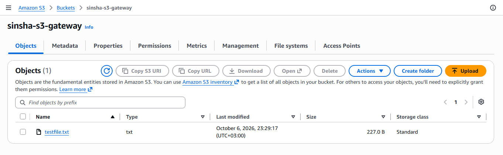
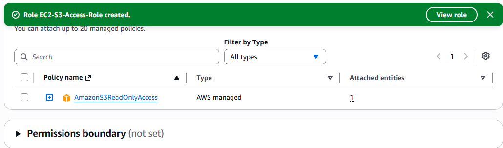
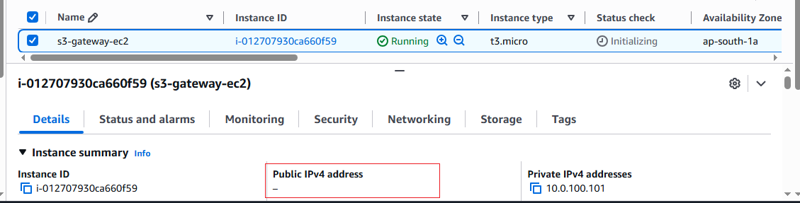
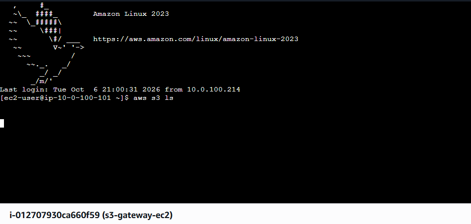
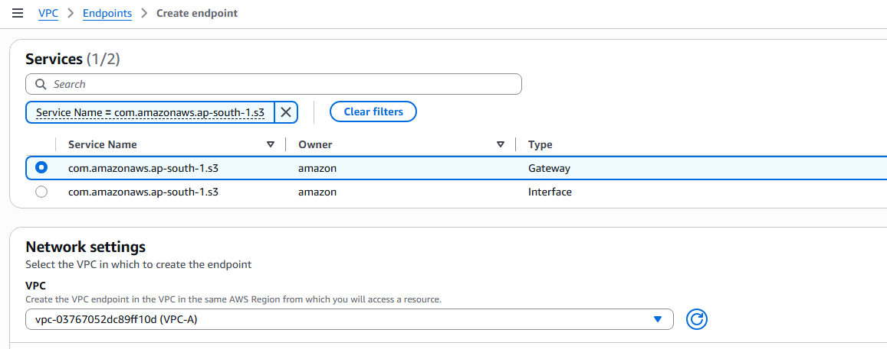
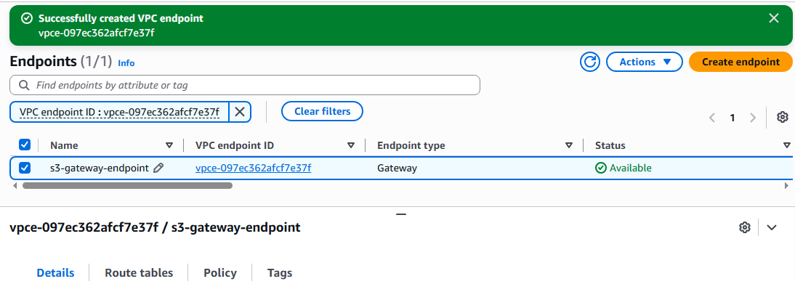
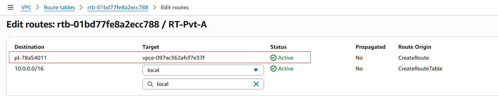
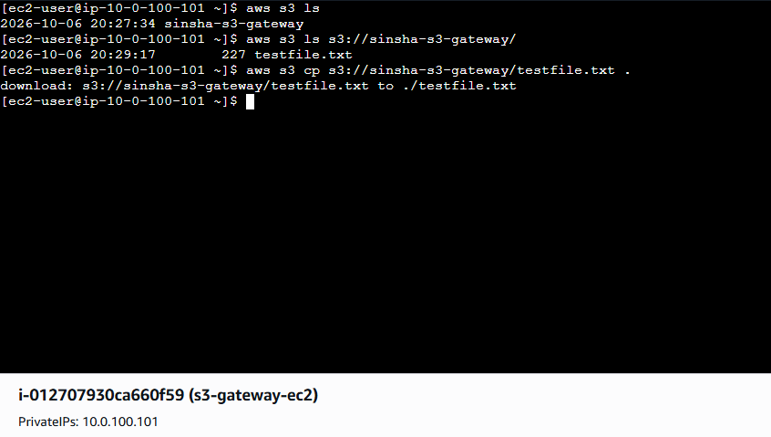

# Configure S3 Gateway Endpoint (Private S3 Access)

## Overview

This lab shows how a **private EC2 instance** (no public IP, no Internet Gateway, no NAT Gateway) can access an **Amazon S3 bucket privately** using an **S3 Gateway VPC Endpoint**.

All traffic stays inside the AWS network and never goes over the public internet.

## Scenario

- EC2 instance in a **private subnet**
- **No public IP**
- **No Internet Gateway** and **no NAT Gateway**
- Requirement: the instance must reach an S3 bucket **privately**

## Architecture

```
Private EC2 ──► Route Table (pl-xxxx → vpce-xxxx) ──► S3 Gateway Endpoint ──► S3 Bucket
        (all inside the VPC / AWS network, no internet)
```


## Prerequisites

- An AWS account
- A VPC with a **private subnet** (no IGW, no NAT)
- An S3 bucket
- An IAM role for EC2 with S3 permissions (e.g., `AmazonS3ReadOnlyAccess` or a custom policy)

---

## Steps

### Step 1: Create an S3 Bucket

1. Go to **S3 → Create bucket**
2. Enter a unique bucket name
3. Keep **Block all public access** enabled
4. Click **Create bucket**
5. Upload a test file (e.g., `test.txt`)



---

### Step 2: Create an IAM Role for EC2

1. Go to **IAM → Roles → Create role**
2. Trusted entity: **AWS service → EC2**
3. Attach policy: **AmazonS3ReadOnlyAccess** (or a bucket-specific policy)
4. Name it `EC2-S3-Access-Role`




---

### Step 3: Launch the Private EC2 Instance

1. Go to **EC2 → Launch instance**
2. AMI: **Amazon Linux 2023** (AWS CLI is pre-installed)
3. Network: your VPC → **private subnet**
4. **Auto-assign public IP: Disable**
5. IAM instance profile: `EC2-S3-Access-Role`
6. Security group: allow **SSH (22)** from your VPC CIDR (e.g., `10.0.0.0/16`) — see the note below
7. Launch the instance

> **Why this rule is needed**
> The instance has no public IP, so you connect through an **EC2 Instance Connect Endpoint** inside the VPC. SSH reaches the instance from the endpoint's private IP, so port 22 must be allowed from inside the VPC.
>
> - **Simple (this lab):** Inbound `SSH (22)`, Source = VPC CIDR
> - **More secure:** Source = the endpoint's security group (`eice-sg`)
>
> This is for management access only, separate from the S3 Gateway Endpoint.



---

### Step 4: Verify No Internet Access (Before Endpoint)

Since there is no IGW or NAT, the instance cannot reach the internet or S3.

> **How to connect to a private instance with no internet?**
> Use an **EC2 Instance Connect Endpoint** (VPC → Endpoints → Create endpoint → *EC2 Instance Connect Endpoint*), then connect from the EC2 console.
>
> **Create the endpoint's security group first (before creating the endpoint):**
> 1. Go to **EC2 → Security Groups → Create security group** and name it `eice-sg` (same VPC)
> 2. Inbound rules: none needed
> 3. Outbound rule: **SSH (22)** to your VPC CIDR (or to the instance's security group)
> 4. Select `eice-sg` when creating the Instance Connect Endpoint
>
> **Update the instance's security group to allow SSH only from `eice-sg`:**
> 1. Go to **EC2 → Instances →** select your private instance **→ Security** tab **→** click the security group
> 2. **Edit inbound rules**
> 3. Change the SSH rule: Type `SSH`, Port `22`, Source = **Custom → `eice-sg`** (instead of the VPC CIDR)
> 4. Click **Save rules**
>
> Now only the Instance Connect Endpoint can reach port 22 on the instance.

Run on the instance:

```bash
aws s3 ls
```

Expected result: the command **hangs / times out** (no route to S3).



**eice-sg**


---

### Step 5: Create the S3 Gateway Endpoint

1. Go to **VPC → Endpoints → Create endpoint**
2. Name: `s3-gateway-endpoint`
3. Service category: **AWS services**
4. Service name: `com.amazonaws.<region>.s3`
5. Type: **Gateway**
6. VPC: select your VPC
7. Route tables: select the **private subnet's route table**
8. Policy: **Full access** (default)
9. Click **Create endpoint**

**Select S3 Gateway service**



**Endpoint available**



---

### Step 6: Verify the Route Table

Open the private subnet's route table → **Routes** tab.

A new route is added automatically:

| Destination | Target |
|-------------|--------|
| `pl-xxxxxxxx` (S3 prefix list) | `vpce-xxxxxxxx` |



---

### Step 7: Test S3 Access (After Endpoint)

Run on the private EC2 instance:

```bash
aws s3 ls
aws s3 ls s3://<your-bucket-name>
aws s3 cp s3://<your-bucket-name>/test.txt .
cat test.txt
```

Expected result: the bucket is listed and the file downloads successfully. ✅



---

## Result

| Check | Before Endpoint | After Endpoint |
|-------|-----------------|----------------|
| Public IP on EC2 | ❌ None | ❌ None |
| IGW / NAT Gateway | ❌ None | ❌ None |
| `aws s3 ls` | ❌ Timeout | ✅ Works |
| Traffic path | — | Private (AWS network) |

## Key Points

- A **Gateway Endpoint** is used only for **S3** and **DynamoDB**.
- It is **free** (no hourly or data processing charge).
- It works by adding a **route in the route table**, so no changes are needed on the instance.
- It is **regional** and works only for buckets in the **same Region** as the VPC.
- It cannot be accessed from on-premises or peered VPCs (use an **Interface Endpoint** for that).

## Limitations

- Supports only S3 and DynamoDB
- Same-Region access only
- Not reachable via VPN, Direct Connect, or VPC peering

## Cleanup

1. Delete the S3 Gateway Endpoint
2. Terminate the EC2 instance
3. Delete the EC2 Instance Connect Endpoint (if created)
4. Empty and delete the S3 bucket
5. Delete the IAM role

---

## Author

**Sinsha C**

## Connect

If you're on a similar AWS DevOps learning journey, feel free to connect or follow along:

[](https://github.com/sinsha-c)
[](https://linkedin.com/in/sinshac)
